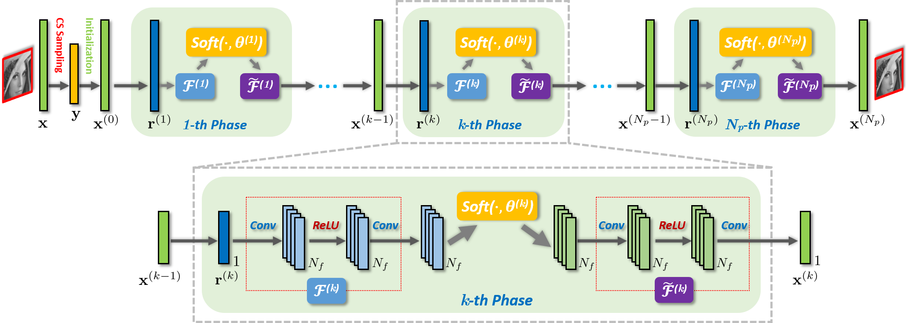

# ISTA-Net
Implementing ISTA-Net, an interpretable optimization-inspired deep network for image compressive sensing as proposed by Zhang and Ghanem in [this paper.](Zhang_ISTA-Net_Interpretable_Optimization-Inspired_CVPR_2018_paper.pdf)

```
@inproceedings{zhang2018ista,
  title={ISTA-Net: Interpretable Optimization-Inspired Deep Network for Image Compressive Sensing},
  author={Zhang, Jian and Ghanem, Bernard},
  booktitle={CVPR},
  pages={1828--1837},
  year={2018}
}
```

## How to run
- Download the dataset `Training_Data_Img91.mat` from [this link,](https://drive.google.com/open?id=1RBYOg6F2dxGWoCrBvQyf93hXI-OEfzHs) place it in the current directory and then run `ista_net.py`. This file contains detailed comments.
- Interactive training and experimentation was done in Google Colab, and the Jupyter notebook has been uploaded in the current directory as `ista_net_jupyter.ipynb`. This file does not contain any comments, and was used by me for iterating over diffferent models quickly. If Github doesn't preview this file for you, please view it [here.](https://nbviewer.jupyter.org/github/hansinahuja/ISTA-Net/blob/master/ista_net_jupyter.ipynb)
- Both these files contain the same code. I recommend reading both files, one for a detailed thought process, and the other to see running outputs line by line.

## Observations and assumptions
- The number of parameters mentioned in the paper is = 336,978. That is for Nb = 9. For Nb = 5 (as implemented in their Github code), number of parameters = (336,978x5)/9 = 187,210, consistent with my Keras implementation. 
- I didn't have the processing power to train the model for 300 epochs, so I ran the training for 25 epochs and compared the results against the first 25 epochs of the code provided by the authors. Their implementation seemed to converge faster, but suffered from irregular gradients. My model converged slower, but had a gentle cost gradient. These epochs are detailed in the Jupyter notebook, and the authors' observations are well-described in their paper.

## Model visualisation

Author's visualisation:



Visualisation of my implementation:


